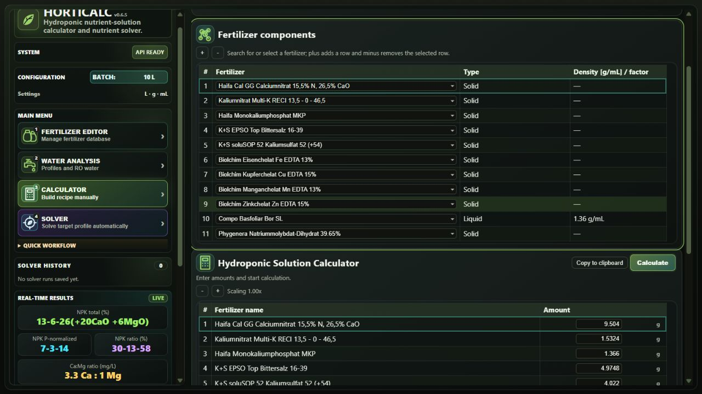
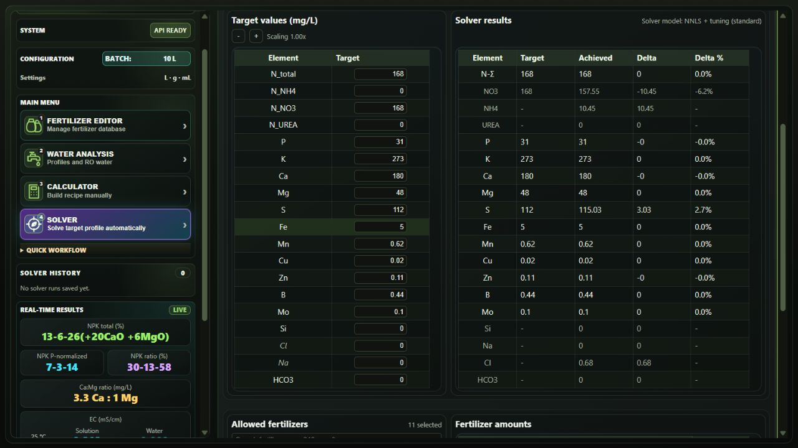

# Horticalc

Horticalc is a local, open-source fertilizer calculator for horticultural
nutrient solutions. It turns fertilizer analyses, water data, batch volume,
doses, and RO mixing into elemental, oxide, NPK, dissolved-ion, ion-balance, and
EC results. The Solver works backwards from a nutrient target or published
formula to calculate doses from the fertilizers you actually have, making it
useful for reproducing or adapting solutions with alternative agricultural
products.

## Quick start

### Windows installer (recommended)

1. Download `horticalc-vX.Y.Z-windows-setup.exe` from the
   [latest release](https://github.com/onethree7/Horticalc/releases/latest).
2. Run the installer. It installs for the current user without administrator
   rights.
3. Start **Horticalc** from the Start menu.

### Portable Windows

1. Download `horticalc-vX.Y.Z-windows.zip` from the latest release.
2. Before extracting, right-click the ZIP and open **Properties**. If Windows
   shows **Unblock** under **Security**, select it and click **Apply**.
3. Then extract the complete archive to a writable directory and run
   `Horticalc.exe` inside it. See [startup problems](docs/usage.md#startup-problems)
   if it was extracted before unblocking.

### Linux

1. Download `horticalc-vX.Y.Z-linux.tar.gz` for x86_64 from the latest release.
2. Extract it to a writable directory.
3. Run `./horticalc` from the extracted directory.

To run from source, see [Contributing](CONTRIBUTING.md).

## First calculation

1. Open **Calculator** and set the batch volume.
2. Add a fertilizer and enter its dose.
3. Select or enter the water analysis.
4. Choose **Calculate** and inspect the nutrient and EC results.

The **Solver** performs the reverse workflow: provide nutrient targets and the
fertilizers it may use, then review the proposed doses before applying them.

## Screenshots

### Calculator



### Solver



## System requirements and startup help

Windows 10 and 11 require the
[Microsoft WebView2 Runtime](https://developer.microsoft.com/microsoft-edge/webview2/),
which is already present on most current systems. If Horticalc reports it
missing, install it from Microsoft.

The Linux build requires GTK 3 and WebKitGTK 4.1:

```bash
# Ubuntu, Debian, and Linux Mint
sudo apt update && sudo apt install -y libgirepository-1.0-1 gir1.2-webkit2-4.1

# Fedora
sudo dnf install -y webkit2gtk4.1
```

If a portable Windows copy reports Mark of the Web, Windows' downloaded-file
security metadata, delete the freshly extracted application, unblock the
original ZIP if the option appears, and extract it again. Horticalc stores
startup details in `logs/launcher.log`.

## Documentation

- [Using Horticalc](docs/usage.md)
- [Command-line interface](docs/cli.md)
- [HTTP API](docs/api.md)
- [Solver and EC models](docs/solver.md) · [EC](docs/ec.md)
- [Data formats](docs/data-formats.md)
- [Architecture](docs/architecture.md)
- [Contributing](CONTRIBUTING.md) · [Releases](RELEASE.md) · [Security](SECURITY.md)

## Data and safety

Bundled fertilizer data and target profiles are point-in-time references, not
manufacturer instructions. Check current labels and technical documentation
before mixing or dosing a real solution.

## License

Horticalc is licensed under GPL-3.0-or-later. See [LICENSE](LICENSE).
