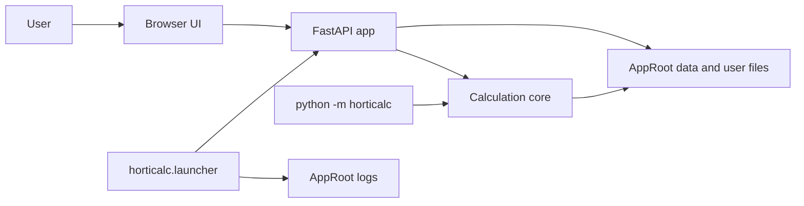

# Architecture

Horticalc has five active runtime layers:

1. Calculation core in `src/horticalc/`.
2. FastAPI app in `api/app.py`.
3. Static browser UI in `frontend/`.
4. Portable launcher in `src/horticalc/launcher.py`.
5. Packaged release workflow in `scripts/packaging/` and `.github/workflows/release.yml`.

## Runtime Map



## Source Of Truth By Concern

| Concern | Source files | Notes |
| --- | --- | --- |
| Recipe calculation | `src/horticalc/core.py` | Converts fertilizer grams and water values into solution output. |
| EC | `src/horticalc/ec.py` | Computes ion-based EC at 18 C and 25 C. |
| NPK and ratios | `src/horticalc/metrics.py` | Formats NPK strings and summary ratios. |
| Sluijsmann | `src/horticalc/sluijsmann.py` | Computes CaO-equivalent alkalinity/acidity metric. |
| Solver | `src/horticalc/solver.py`, `src/horticalc/solver_config.py` | Solves target profiles into fertilizer grams. |
| Data paths | `src/horticalc/paths.py` | Defines AppRoot, shipped defaults, user copies, logs, and lockfile layout. |
| Persistence IO | `src/horticalc/data_io.py` | Loads and saves CSV/YAML data. |
| API | `api/app.py` | Exposes JSON API routes, accepts YAML request bodies on save endpoints, and serves the frontend. |
| UI | `frontend/index.html`, `frontend/app.js`, `frontend/styles.css` | Static app frame, workflows, and browser state. |
| Launcher | `src/horticalc/launcher.py` | Starts API, waits for health, opens browser, and manages the owner lock plus active launcher sessions. |
| Packaging | `scripts/packaging/*`, `.github/workflows/release.yml` | Builds and smoke-tests onedir release artifacts. |

## Request Flow

The UI is served by the backend from the same origin. API routes are declared
before the catch-all static mount, then `app.mount("/", StaticFiles(...,
html=True))` serves `frontend/index.html` and assets.

Calculator flow:

1. UI builds a recipe payload from selected fertilizers, water values, liters,
   nitrogen handling, phosphate species, and osmosis percent.
2. UI posts to `/calculate`.
3. `api/app.py` validates allowed water keys and fertilizer names.
4. `compute_solution()` in `core.py` applies osmosis, normalizes water forms,
   calculates elements, oxides, ions, ion balance, EC, NPK, Sluijsmann, and
   returns the solution output.

Solver flow:

1. UI builds target values, allowed fertilizers, optional fixed grams, water
   profile data, and solver config.
2. UI posts to `/solve`.
3. `solve_recipe_data()` subtracts water baseline, builds the fertilizer
   contribution matrix, solves non-negative grams, recomputes the achieved
   solution with the core path, and returns solver errors.
4. The user may copy the solver result or apply it to the calculator.

## AppRoot And Portable Data

`app_root()` is the repository root in development, the executable folder in
PyInstaller releases, and the install prefix for wheel installs when the
packaged `frontend/`, `data/`, and `recipes/` assets are present. Runtime
writes are portable and stay under AppRoot:

```text
AppRoot/
  data/       shipped defaults
  recipes/    shipped defaults
  frontend/   static UI
  user/       editable user overlays and copied YAML defaults
  logs/       launcher/server logs
```

On startup, `ensure_portable_layout()` creates `user/` and `logs/`, checks that
they are writable, and copies shipped YAML defaults into user space if missing.
The fertilizer catalog stays in `data/fertilizers.csv`; `data_io.py` applies
`user/fertilizers_overrides.csv` and `user/fertilizers_disabled.txt` as an
overlay so shipped catalog updates are visible after app updates.

The launcher lock records the backend owner's PID. Each Chromium app window
also gets a PID-backed session file under `user/launcher_sessions/`. The backend
owner waits until all live launcher sessions have ended, plus a short grace
period for immediate reopen, before stopping the server. Lock cleanup is
owner-aware so an older launcher cannot delete a newer owner's lock. Lock and
session records are written durably, and startup claims the lock exclusively;
concurrent launchers wait for the winning owner's health endpoint instead of
starting a second backend. System-browser fallback cannot observe tab closure,
so it keeps the reusable local server running until the launcher is stopped.

## Current Boundaries

- The core does not know about HTTP or the DOM.
- The API owns request validation and persistence endpoints.
- The UI owns presentation, local browser state, and workflow navigation.
- The solver matrix is a research tool, not product runtime.
- Packaged releases use PyInstaller onedir; onefile is not the project default.
